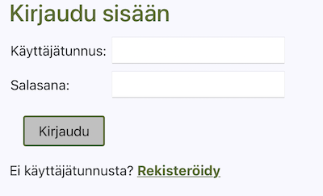

## Lift-o-meter: käyttöohje

Lift-o-meter on sovellus Stronglifts 5x5 -voimaharjoitteluohjelman seurantaan ja automaattiseen kirjanpitoon. Käyttäjätunnusta luotaessa sovellus pyytää käyttäjää arvioimaan (tai kokeilemaan) lähtövoimatasonsa viidessä klassisessa voimailuliikkeessä. Tämän jälkeen voi aloittaa harjoittelun niin sanotusti aivot narikassa, sovellus hoitaa treeniohjelman laskennan ja seurannan automaattisesti.

(Sivuhuomio: tosielämässä Lift-o-Meteriä todennäköisesti käytettäisiin älypuhelimella ja paras toteutustapa olisi natiivi mobiilisovellus. Tämänhetkinen toteutus toimii jotenkuten responsiivisesti mutta ei ihanteellisesti mobiiliruudulla. Tämä on yksi kehityskohteista, jos joskus innostun ja ehdin kehittää tästä oikean, yleiskäyttöisen treeninseurantatyökalun.)

### Lyhyesti Stronglifts 5x5:sta

Stronglifts 5x5 on erityisesti aloittelijoille suunnattu voimaharjoitteluohjelma, joka perustuu viiteen klassiseen voimaharjoitteluliikkeeseen: kyykky, penkkipunnerrus, kulmasoutu, pystypunnerrus, maastaveto. Järjestelmä on yksinkertainen:

- [ ] Kaksi erilaista harjoituskertaa vuorottelevat. Jokainen harjoituskerta alkaa kyykyllä, kaksi seuraavaa liikettä vuorottelevat harjoituskerran mukaan.
- [ ] Liikkeessä tehdään viisi sarjaa., poikkeuksena maastaveto, jota ylirasituksen välttämiseksi tehdään vain yksi sarja.
- [ ] Jos kaikki viisi sarjaa onnistuvat, seuraavaan harjoitukseen lisätään 2,5 kiloa, poikkeuksena jälleen maastaveto, jossa lisäys 5 kiloa.
- [ ] Jos yksikin jonkin liikkeen sarjoista epäonnistuu, kyseisen liikkeen seuraavaan harjoituskertaan ei lisätä painoja.
- [ ] Jos myös uusintayritykset samoilla painoilla epäonnistuvat kaksi kertaa peräkkäin, seuraavaan harjoituskertaan vähennetään painoa 20 prosenttia. Tämä on voimaharjoittelussa yleisesti käytetty kikka, jolla "huijataan" keho jumituskohdan yli.

Lisää Stronglifts-ohjelmasta [voi lukea esim. täältä](https://stronglifts.com).

### Käyttäjätunnus ja kirjautuminen

Sovelluksen etusivu tarjoaa sisäänkirjautumistoiminnon sekä linkin uuden käyttäjätunnuksen luomiseen. Sovelluksessa on myös valmiiksi luotu tunnus (käyttäjätunnus **testuser**, salasana **testpw**), jossa simuloituna jonkin verran harjoitushistoriaa.

### Navigointi

Sovelluksessa liikutaan ylälaidan navigointipalkin avulla. Vasemmanpuoleisin linkki vie päänäkymään (joka myös aukeaa kirjautumisen jälkeen), keskimmäinen kehitysgraafiin ja oikeanpuoleisesta kirjaudutaan ulos.

### Päänäkymä

Sovelluksen päänäkymä näyttää harjoitukset: ylimpänä on seuraavana vuorossa oleva, ja tämän alla laskevassa aikajärjestyksessä aiemmat, jo tehdyt harjoitukset. Tehdyistä harjoituksista näytetään päivämäärä, kunkin liikkeen kilomäärä ja värikoodi, joka kertoo liikkeen onnistumisesta. Jos väri on punainen, vähintään yksi sarja on jäänyt vajaaksi, joten kyseisessä liikkeessä ei lisätä painoa seuraavaan harjoitukseen (tai sitä jopa vähennetään, jos epäonnistumisia on tullut kolmessa peräkkäisessä harjoituksessa). Jos väri on vihreä, liike on täysin onnistunut ja seuraavassa harjoituksessa on luvassa isommat raudat.

Kun seuraavana vuorossa olevan harjoituksen käynnistää painikkeesta, se siirtyy interaktiiviseen tilaan, jossa voi naksutella kullekin sarjalle toistomäärät. Kun harjoitus on valmis, painetaan Valmis-painiketta, jolloin harjoitus tallentuu ja sovellus generoi seuraavan harjoituksen.

### Kehitysgraafi

Kehitys-näkymästä löytyy graafi, joka näyttää edistyksen eri liikkeissä. (Valitettavasti graafissa on toistaiseksi pari kauneusivirhettä, joiden ratkaisu vaatinee debuggausta kolmannen osapuolen Recharts-kirjaston kanssa.)

